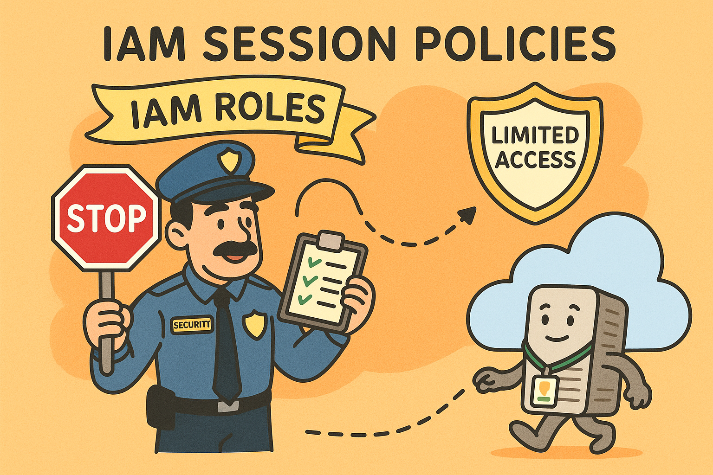

# AWS IAM Session Policies Lab



## 🔐 What are IAM Session Policies?

IAM Session Policies are JSON documents that you can use to dynamically restrict the permissions of a temporary session when you assume a role in AWS. Think of them as "permission guardrails" that you can apply on-the-fly when someone needs temporary access to AWS resources.

Unlike standard IAM policies that are attached to users or roles permanently, session policies are applied only during the temporary session created when assuming a role through AWS Security Token Service (STS).

## 🎯 Why Use Session Policies?

Session policies allow you to:

- **Limit permissions** of a powerful role without modifying the role itself
- **Grant temporary access** with precise permission boundaries
- **Follow the principle of least privilege** by providing only the permissions needed for a specific task
- **Add an extra layer of security** for sensitive operations
- **Apply dynamic changes** on-the-fly, making them more flexible than SCPs and IAM permission boundaries

## 🔄 Session Policies vs. Other AWS Permission Controls

| Control Mechanism | Scope | Who Manages | Use Case |
|-------------------|-------|-------------|----------|
| **Session Policies** | Individual session level | Individual users/developers | Dynamic, temporary access restrictions for specific tasks |
| **Service Control Policies (SCPs)** | Organization level | Cloud administrators | Broad guardrails across multiple AWS accounts |
| **Permission Boundaries** | AWS account level | Account administrators | Setting maximum permissions for IAM entities within an account |

Session policies are unique because they can be applied instantly without administrative overhead, making them ideal for developers and operators who need to temporarily restrict their own permissions for specific tasks.

## 🧪 Hands-on Lab: "Operation Secure Access"

### Scenario: CloudCorp Security Incident

You're a security engineer at CloudCorp, a company that manages critical infrastructure in AWS. A recent security audit revealed that some administrators have been using their full admin privileges for routine tasks, creating unnecessary security risks.

Your mission: Implement session policies to enforce the principle of least privilege without disrupting the workflow of your SysAdmins.

### Lab Setup

For this lab, you'll need AWS CLI configured on your local computer or you can use AWS CloudShell. You can also use an EC2 instance or Cloud9 environment if you prefer.

> **Important Note**: We emphasize using the AWS CLI in this lab because roles with external IDs cannot be assumed using the AWS Management Console. If you want to use the console instead, you would need to remove the external ID requirement, which would eliminate this additional layer of security.

#### Step 1: Create the SysAdmin Role

First, let's create a SysAdmin role with full administrative permissions and protect it with an external ID:

**Option A: Using AWS Console**

1. Go to the IAM console in your AWS account
2. Click on "Roles" and then "Create role"
3. Select "Another AWS account" as the trusted entity
4. Enter your own AWS account ID
5. Check the "Require external ID" option and enter a secret value (e.g., "543210012345")
6. Click "Next: Permissions"
7. Attach the "AdministratorAccess" policy
8. Click "Next: Tags", add any tags if needed
9. Click "Next: Review"
10. Name the role "SysAdmin" and click "Create role"

**Option B: Using AWS CLI**

1. Create a trust policy file named `trust-policy.json`:
```json
{
  "Version": "2012-10-17",
  "Statement": [
    {
      "Effect": "Allow",
      "Principal": {
        "AWS": "arn:aws:iam::<YOUR-ACCOUNT-ID>:root"
      },
      "Action": "sts:AssumeRole",
      "Condition": {
        "StringEquals": {
          "sts:ExternalId": "<YOUR-SECRET-EXTERNAL-ID>"
        }
      }
    }
  ]
}
```

2. Create the role using AWS CLI:
```bash
aws iam create-role \
  --role-name SysAdmin \
  --assume-role-policy-document file://trust-policy.json

aws iam attach-role-policy \
  --role-name SysAdmin \
  --policy-arn arn:aws:iam::aws:policy/AdministratorAccess
```

Now we'll use session policies to create three different types of temporary sessions:

1. **S3 Read-Only Session**: For auditing S3 buckets
2. **EC2 Read-Only Session**: For monitoring EC2 instances
3. **Full Admin Session**: For rare cases requiring full access

### Step 2: Examine the Session Policies

#### S3 Read-Only Policy
```json
{
    "Version": "2012-10-17",
    "Statement": [
        {
            "Effect": "Allow",
            "Action": [
                "s3:Get*",
                "s3:List*",
                "s3:Describe*",
                "s3-object-lambda:Get*",
                "s3-object-lambda:List*"
            ],
            "Resource": "*"
        }
    ]
}
```

This policy allows read-only operations on S3 buckets and objects.

#### EC2 Read-Only Policy
```json
{
    "Version": "2012-10-17",
    "Statement": [
        {
            "Effect": "Allow",
            "Action": "ec2:Describe*",
            "Resource": "*"
        },
        {
            "Effect": "Allow",
            "Action": "elasticloadbalancing:Describe*",
            "Resource": "*"
        },
        {
            "Effect": "Allow",
            "Action": [
                "cloudwatch:ListMetrics",
                "cloudwatch:GetMetricStatistics",
                "cloudwatch:Describe*"
            ],
            "Resource": "*"
        },
        {
            "Effect": "Allow",
            "Action": "autoscaling:Describe*",
            "Resource": "*"
        }
    ]
}
```

This policy allows read-only operations on EC2 instances and related services.

### Step 3: Assume Role with Session Policies

Use AWS CLI to assume the SysAdmin role with different session policies:

#### For S3 Read-Only Access:
```bash
aws sts assume-role \
  --role-arn "arn:aws:iam::<aws-account-id>:role/SysAdmin" \
  --role-session-name "s3-read-only-session" \
  --policy file://s3-read-only-policy.json \
  --external-id "<external-id>"
```

#### For EC2 Read-Only Access:
```bash
aws sts assume-role \
  --role-arn "arn:aws:iam::<aws-account-id>:role/SysAdmin" \
  --role-session-name "ec2-read-only-session" \
  --policy file://ec2-read-only-policy.json \
  --external-id "<external-id>"
```

#### For Full Admin Access (No Session Policy):
```bash
aws sts assume-role \
  --role-arn "arn:aws:iam::<aws-account-id>:role/SysAdmin" \
  --role-session-name "full-admin-session" \
  --external-id "<external-id>"
```

### Step 4: Test Your Access

After assuming each role, set the temporary credentials in your environment and test your access:

1. **S3 Read-Only Session**:
   - Try listing S3 buckets: `aws s3 ls` (should work)
   - Try creating an S3 bucket: `aws s3 mb s3://test-bucket` (should fail)
   - Try listing EC2 instances: `aws ec2 describe-instances` (should fail)

2. **EC2 Read-Only Session**:
   - Try listing EC2 instances: `aws ec2 describe-instances` (should work)
   - Try stopping an EC2 instance: `aws ec2 stop-instances --instance-ids i-1234567890abcdef0` (should fail)
   - Try listing S3 buckets: `aws s3 ls` (should fail)

3. **Full Admin Session**:
   - All operations should work as expected

## 🔍 Key Takeaways

1. **Granular Control**: Session policies let you fine-tune permissions for temporary sessions
2. **Non-Destructive**: They don't modify the underlying role permissions
3. **Least Privilege**: They help enforce the principle of least privilege
4. **Audit Trail**: Different session names create clear audit trails in CloudTrail

## 🚀 Challenge Tasks

1. Create a custom session policy that allows read access to both S3 and EC2, but no other services
2. Modify the EC2 read-only policy to allow access to only specific EC2 instances using resource ARNs
3. Create a session policy that allows full access to a specific S3 bucket but denies access to a specific object within that bucket

## 📚 Additional Resources

- [AWS IAM Session Policies Documentation](https://docs.aws.amazon.com/IAM/latest/UserGuide/access_policies.html#policies_session)
- [AWS STS AssumeRole API Reference](https://docs.aws.amazon.com/STS/latest/APIReference/API_AssumeRole.html)
- [AWS IAM Best Practices](https://docs.aws.amazon.com/IAM/latest/UserGuide/best-practices.html)

---

Happy securing! 🛡️